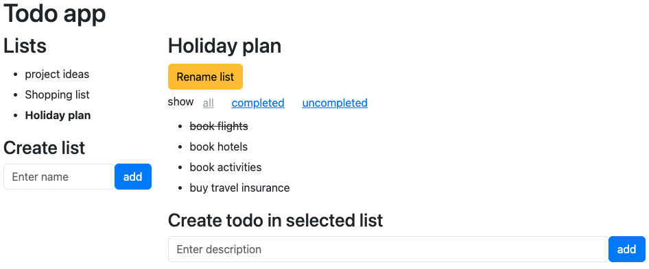

[Followup questions](FOLLOWUP.md)

# How to run the project

1. go to the backend directory
2. copy `.env.example` to `.env`
3. run `php artisan migrate` to create the DB
4. run `php artisan serve` (this also serves the frontend)
5. open http://localhost:8000
